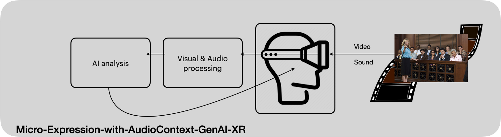

- Dare to dream
- Ignite your inspiration and innovation
- Strive for excellence
- Explore together & unlock the world's knowledge

# MicroExpressionWithVoiceContext-GenAI-XR
An inflection point in human interactions facilitated by GenAI and XR in both visual and audio domains.

This platform goes beyond conventional emotion decoding. It taps into the intricate nuances of facial micro-expressions and vocal dynamics, offering an unprecedented depth of insights into the emotional tapestry of individuals navigating legal scenarios or other business processes.

This cutting-edge platform leverages state-of-the-art GenAI and XR technologies to deliver an unparalleled tool for human analysis. It employs an innovative approach that surpasses conventional emotion decoding methodologies by delving into the intricate subtleties of facial micro-expressions and vocal dynamics (tone & pitch & rate). It marks an inflection point in human interactions, utilizing advanced ANN algorithms to yield an unparalleled depth of insights into the complex emotional landscape exhibited by individuals engaged in legal scenarios or other procedural processes.

Preliminary test feedback from "istockphoto-465858368-612x612.jpeg"

 In the image, there is a range of expressions and body language displayed by the jurors.

 Starting from the left:

 1. The first juror, an older man with glasses, appears to be paying close attention, with a neutral facial expression that indicates he is focused on the speaker.

 2. Next to him, a man in a blue tie seems slightly skeptical or in deep thought, furrowing his brow and resting his face on his hand.

 3. The third juror has his arms crossed, which can often indicate a defensive or closed-off attitude; however, he is looking directly at the speaker, showing engagement.

 4. The woman in the center with her hair pulled back, she appears to be serious and attentive, with a neutral expression possibly indicating contemplation or careful listening to the proceedings.

 5. The man next to her has a slight frown and is also in a contemplative pose, resting his head on his hand with a furrowed brow, suggesting he may be critically evaluating what he is hearing.

 6. The next woman in line looks to be somewhat tense or concerned, reflected in her tight-lipped expression and the way she holds her hands together.
